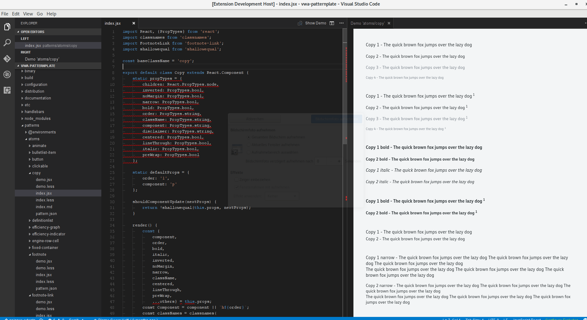

# patternplate-vscode

The "patternplate-vscode" currently validates and supports in pattern.json creation and editing.
This is based on the jsonschema file for pattern.json files.  
In addition to this it is possible to render pattern demos like the markdown preview - either next to the current
editor or in a separate tab.

## Release Notes

### 0.3.0

* Add extension points for opening demo to editor context menu

### 0.2.0

Rendering demos while editing

### 0.1.0

Initial release of patternplate-vscode
